# `ScheduledCmdWindow` — CSM 模块接口文档

> ⚠️ **AI 自动生成，还未经过人工审阅**
>
> 本文档由 AI 基于 `ScheduledCmdWindow.vi` 的程序框图、前面板结构与 `_support/` 下的从属 VI 自动生成，可能包含不准确或遗漏的信息。请在合并前进行人工核查。

---

## 功能简述

`ScheduledCmdWindow` 是一个带独立前面板的 CSM 模块，用于**按时间戳调度 CSM 命令**。

模块维护一张「命令 + 执行时间 + 是否每日重复」的列表：到点后由本模块把命令作为 CSM 脚本发出；一次性命令执行后从列表移除，每日重复命令的时间戳推后一天。前面板实时显示未到点的命令及剩余时间。

---

## 模块信息

| 属性           | 值                             |
| -------------- | ------------------------------ |
| LabVIEW 版本   | ≥ 2020                         |
| 支持的操作系统 | Windows / Linux / macOS        |
| 支持 RT        | ❌ 不支持                      |
| 支持 64-bit    | ✅ 支持                        |
| 所属模块组     | `CSM-ScheduledCmdWindow.lvlib` |

---

## 依赖项

| 依赖                                                                                                | 类型 |
| --------------------------------------------------------------------------------------------------- | ---- |
| [Communicable-State-Machine](https://github.com/NEVSTOP-LAB/Communicable-State-Machine)             | 必须 |
| [CSM-API-String-Arguments-Support](https://github.com/NEVSTOP-LAB/CSM-API-String-Arguments-Support) | 必须 |

> 两个 API 的参数都经 API String Arguments Support 编解码。

---

## API 接口（消息接口）

### `API: Add`

向待执行命令列表追加一条命令，并按执行时间升序重排整个列表。

- **参数**：`APIString` — `Cluster`：
  - `Command`：String，到点后要执行的 CSM 消息字符串
  - `TimeStamp`：Timestamp，计划执行时间
  - `Daily?`：Boolean，是否每日重复
- **响应**：N/A

参数是标签-数据对形式的 API String，标签必须与上列字段名完全一致：

```csm
{Command:<CSM 消息字符串>;TimeStamp:<时间>;Daily?:<TRUE|FALSE>}
```

- `TimeStamp` 支持 RFC3339（`2026-05-15T11:14:11Z`）或 `时间字符串(格式字符串)`；省略该标签时保持簇原型值（LabVIEW 零时间戳，即 1904-01-01）。
- `Daily?` 省略时为 FALSE；与原型值一致的字段可以不写。

### `API: Remove By Indexs`

按行号删除待执行命令列表中的命令，行号与前面板列表框的行一一对应。

- **参数**：`APIString` — `I32[]`：要删除的行号数组，例如 `[0,2]`
- **响应**：N/A

多个行号在删除前按升序排序，因此行号按删除前的列表计数。

### `UI: Front Panel State`

控制本模块前面板的显示状态。

- **参数**：`APIString` — `Enum`：`Open` / `Close` / `Hidden` / `Minimize` / `Maximize`
- **响应**：N/A

### `UI: Cursor Set`

设置前面板光标样式。

- **参数**：`APIString` — `Enum`：`Busy` 或 `Idle`；其他值按 `Idle` 处理
- **响应**：N/A

---

## 状态广播接口

### `Error Occurred`

**默认广播类型**：`Status`

模块内部发生错误时广播。

- **参数**：`ErrStr` — `String`：`<ErrStr>[Error: error-code] error-description` 格式的错误信息

订阅示例：

```csm
Error Occurred@ScheduledCmdWindow >> Error Handler@Main -><register>
```

---

## 属性接口

本模块不对外暴露属性。

---

## 配置说明

### 前面板控件

| 控件名称                     | 类型            | 默认值      | 说明                                                                 |
| ---------------------------- | --------------- | ----------- | -------------------------------------------------------------------- |
| `Name ("" to Use UUID)`      | String          | `Event CSM` | CSM 模块名；传入空字符串时由 CSM 生成 UUID                            |
| `Add Btn`（标题「添加」）    | Boolean（锁存） | FALSE       | 打开时间戳选择对话框，确认后向列表追加一条命令                        |
| `Remove Btn`（标题「移除」） | Boolean（锁存） | FALSE       | 删除列表框中选中的行，非空选择会先弹出确认对话框                      |

`Multicolumn Listbox`（列：`命令类型`、`时间戳`、`剩余时间`、`重复?`）与 `SharedData` 为纯显示指示器，不参与配置。

### INI 文件配置

本模块不读取 INI 文件。

---

## 调用限制与注意事项

> [!IMPORTANT]
>
> - 模块以其名称（`Name` 输入）在系统中唯一标识，同一名称不可同时运行多个实例。
> - `API: Add` / `API: Remove By Indexs` 的参数**必须**使用标签-数据对形式；不带标签的形式解析失败并返回错误。
> - `API: Add` 省略 `TimeStamp` 时取簇原型值（LabVIEW 零时间戳），该时间已过期。
> - 前面板「添加」对话框提供的候选命令是程序框图常量，仅 `API: Start -@ DAQ` 与 `API: Stop -@ DAQ` 两项；添加其他命令需直接发送 `API: Add` 消息。
> - 到点命令由本模块以自身为发送方执行，命令中的相对模块名按本模块所处的 CSM 系统解析。
> - 待执行列表的刷新与到点检查周期为 100 ms，命令的实际执行时刻因此有不超过该周期的延迟。
> - 退出使用 `Macro: Exit`；若模块运行在运行引擎（Run-Time System）下，或前面板在启动时已处于关闭状态，退出时模块会关闭自己的前面板。
> - `UI: Cursor Set` 在非 Windows 目标上不产生动作。

---

## 使用示例

> 将 `ScheduledCmdWindow` 替换为启动模块 VI 时实际传入的名称。模块由 CSM 启动器加载时会自动执行 `Macro: Initialize`，无需显式发送。

### 基本生命周期

```csm
// 1. 添加一条一次性命令（同步调用，等待执行完成）
API: Add >> {Command:API: Start -@ DAQ;TimeStamp:2026-05-15T11:14:11Z} -@ ScheduledCmdWindow

// 2. 添加一条每日重复的命令
API: Add >> {Command:API: Stop -@ DAQ;TimeStamp:2026-05-15T22:00:00Z;Daily?:TRUE} -@ ScheduledCmdWindow

// 3. 删除第 0、2 行
API: Remove By Indexs >> [0,2] -@ ScheduledCmdWindow

// 4. 打开前面板查看待执行列表
UI: Front Panel State >> Open -@ ScheduledCmdWindow

// 5. 退出模块（框架宏）
Macro: Exit -@ ScheduledCmdWindow
```

### 订阅状态广播

```csm
// 将本模块的 "Error Occurred" 路由到主程序的错误处理 API
Error Occurred@ScheduledCmdWindow >> Error Handler@Main -><register>

// 取消订阅
Error Occurred@ScheduledCmdWindow >> Error Handler@Main -><unregister>
```

---

## 模块交互图

```mermaid
stateDiagram-v2
direction LR
调用模块 --> ScheduledCmdWindow : "API: Add >> {Command:...;TimeStamp:...;Daily?:...}"
调用模块 --> ScheduledCmdWindow : "API: Remove By Indexs >> [0,2]"
调用模块 --> ScheduledCmdWindow : "UI: Front Panel State >> Open"
ScheduledCmdWindow --> 目标模块 : "Command 中携带的 CSM 消息"
ScheduledCmdWindow --> 订阅模块 : "Error Occurred >> <ErrStr 错误信息>"
```



---

## 备注

- 模块维护的待执行命令列表为 `{Command: String, TimeStamp: Timestamp, Daily?: Boolean}` 数组，同时通过 `SharedData` 指示器暴露。
- 到点命令经 `CSM - Run Script.vi` 发出；重复命令与一次性命令的清理由模块自发状态 `Action: Update` 完成（到期且非重复的命令被移除，到期的重复命令时间戳加 86400 秒）。
- `Action: action2` 是模板占位状态，模块未使用。
- 参数解析使用 `Strict Label Check? = TRUE`，标签名不匹配即报错。
- `_support/` 目录中的 VI 为模块内部辅助：`Command Timer Item.ctl`（列表元素类型定义）、`Select Timestamp Dialog.vi`（「添加」对话框）、`Reorder Commands.vi`、`Increase command Date.vi`、`Format Timeleft String.vi`、`Def-CommandType.ctl`。

---

- _完整 CSM 语法参考：<https://github.com/NEVSTOP-LAB/Communicable-State-Machine/blob/main/.doc/Syntax.md>_
- _CSM Wiki：<https://nevstop-lab.github.io/CSM-Wiki/>_
